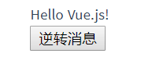
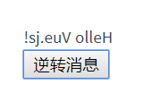

# Vue的安装与介绍
## 安装
- 兼容性：vue不支持IE8以及以下版本，因为Vue使用了IE8无法模拟的ECMAScript 5特性。但它支持所有ECMAScript5的浏览器
  - 引入方式-CDN：
    ```js
      <script src="https://cdn.jsdelivr,net/npm/vue/dist/vue.js"></script>
    ```
    对于生产环境，推荐链接到一个 明确的 版本号和文件，不然后果可能不堪设 想！
     ```js
       <script src="https://cdn.jsdelivr.net/npm/vue@2.6.0></script>
     ```
  - 引入方式-NPM

    在用Vue构建 **大型应用** 时推荐使用NPM安装。NPM能很好地和诸如webpack或Browserify模块打包器配合使用。同时Vue也提供配套工具来开发单文件组件
    ```
    npm install vue
    ```
## Vue的介绍
- [Vue.js是什么](https://cn.vuejs.org/v2/guide/index.html#Vue-js-%E6%98%AF%E4%BB%80%E4%B9%88)

- 声明式渲染
  - Vue.js的核心是一个允许采用简洁的模板来声明式地将数据想染进DOM的系统
  - 创建了Vue应用后，当数据和DOM已经被建立了关联，所有东西都是响应式的。

## Vue的常用指令
- 什么是指令
  - 指令带有前缀 v-，以表示它们是 Vue 提供的特殊特性,它们会在渲染的 DOM 上应用特殊的响应式行为
  - 常用指令
    - `v-bind`
    - `v-if`
    - `v-for`
    - `v-on`
    - `v-model`
- V-bind
  ```html
  <div id="app-2">
    <span v-bind:title="message">
        鼠标悬停几秒钟查看此处动态绑定的提示信息！
    </span>
  </div>
  ```
  ```js
  var app2 = new Vue({
    el: '#app-2',
    data: {
      message: '页面加载于 ' + new Date().toLocaleString()
    }
  })
  ```
  - 该指令的意思是：“将这个元素节点的 title 特性和 Vue 实例的 message 属性保持一致”。

- v-if
  - 这个指令可以控制切换一个元素是否显示
    ```html
      <div id="app-3">
           <p v-if="seen">现在你看到我了</p>
      </div>
    ```
    ```js
    var app3 = new Vue({
      el:'#app-3',
      data:{
        seen:true
      }
    })
    ```
    效果
    ```
    现在你看到我了
    ```
    继续在控制台输入app3.seen = false,文字就会消失，说明了不仅可以把数据绑定到DOM 文本或特性，还可以绑定到DOM结构。
- v-for 
   - for指令可以绑定数组的数据来渲染一个项目列表：
      ```html
      <div id="app-4">
         <ol>
           <li v-for="todo in todos">
             {{ todo.text }}
           </li>
         </ol>
      </div>
      ```
      ```JS
       data:{
         todes:[
           {text:'学习Javascript'},
           {text:'学习Javascript'},
           {text:'学习Javascript'}
         ]
       }
      ```
      在控制台里，输入app4.todos.push({text:'新项目'})，就可以在列表添加一个新项目
## 处理用户输入
  - 让用户与应用交互，可以用v-on指令添加一个事件监听器，通过它调用在Vue实例中定义的方法
  ```html
  <div id="app-5">
    <p>{{message}}</p>
    <button v-on:click="reverseMessage">反转消息</button>
  </div>
  ```
  ```js
  var app5 = new Vue({
    el:'#app-5',
    data:{
      message:'Hello Vue.js!'
    },
    methods:{
      reverseMessage:function(){
        this.message = this.message.split(''),reverse().join('')
      }
    }
  })
  ```
  效果
  
  
  
  在reverseMessage方法中，我们更新了应用的状态，但没有触碰DOM--所有的DON操作都由Vue来处理，写代码只需要关注逻辑层即可
# Vue实例
## 创建一个Vue实例
  - [创建一个Vue实例](https://cn.vuejs.org/v2/guide/instance.html#%E5%88%9B%E5%BB%BA%E4%B8%80%E4%B8%AA-Vue-%E5%AE%9E%E4%BE%8B)
  
- 数据与方法
   
  当一个Vue实例被创建时，它将 `data` **响应式系统**中。当这些属性的值发生改时，视图将会产生‘响应’，即匹配更新为新的值
  ```js
  //我们的数据对象
  var data = { a: 1 }

  //该对象被加入到一个Vue实例中
  var vm = new Vue({
    data:data
  })

  //获得这个实例上的属性
  //返回源数据中对应的字段
  vm.a == data.a   // => true

  //设置属性值也会影响到原始数据
  vm.a = 2
  data.a // => 2

  // 相反也是一样的
  data.a = 3
  vm.a // => 3
  ```
  当这些数据改变时，视图会进行 **重渲染**。
   
  注意：只有当实例被创建时 ，就 **已经存在于 `data` 中的属性** 才是 **响应式**的。也就是说如果你添加一个新的属性，比如：
  ```js
  vm.b = 'hi'
  ```
  那么对`b`的改动将 **不会** 触发任何视图的更新。如果你知道你会在晚些时候需要一个属性，但是一开始它为空或不存，那么仅需要设置一些初始值。比如：
  ```js
  data: {
    newTodoText: '',
    visitCount: 0,
    hideCompletedTodos: false,
    todos: [],
    error: null
  }
  ```
  `Object.freeze()`(少用)，使用这个会阻止修改现有的属性，也意味着响应系统无再追踪变化
  ```js
  var obj = {
      foo:'bar'
  }
  Object.freeze(obj)
  new Vue({
      el:'#app',
      data:obj
  })
  ```

  ```html
    <div id="app">
      <p>{{foo}}</p>
      <!-- 这里的`foo`不会更新 -->
      <button v-on:click="foo = 'baz'">Change it</button>
    </div>
  ```
[Vue的生命周期](https://cn.vuejs.org/v2/guide/instance.html#%E5%AE%9E%E4%BE%8B%E7%94%9F%E5%91%BD%E5%91%A8%E6%9C%9F%E9%92%A9%E5%AD%90)
## 前缀$
  - 除了数据属性，Vue 实例还暴露了一些有用的实例属性与方法。它们都有前缀$,以便于用户定义的属性区分开来。例如：
    ```js
    var data = { a: 1 }
    var vm = new Vue({
        el:'#example',
        data:data
    })
  
    vm.$data === data //=>true
    vm.$el === document.getElementById('exmaple') //=>true
  
    //$watch 是一个实例方法
    vm.$watch('a', function ( newValue, oldValue ) {
      //这个回调将在`vm.a`改变后调用
    })
    ```
# 模板语法

## 基础概念
  - [模板语法的基础概念](https://cn.vuejs.org/v2/guide/syntax.html)
## 插值
  - 特性
  
  Mustach语法不能作用在HTML特性上，遇到这种情况应该使用v-bind指令
  
```html
<div v-bind:id="dynamicId"></div>
```
对于布尔值特性(它们只要存在就意味着值为`true`),`v-bind`工作起来就略有不同，在这个例子中：
```html
<button v-bind:disabled="isButtonDisabled">Button</button>
```

如果`isButtonDisabled`的值是`null`、`undefined`或者`false`，则`disabled`特性甚至不会被包含在渲染出来的`<button>`元素中。

- 使用JavaScript表达式
  - 在模板中可以绑定简单的属性键值。但是实际上，对于所有的数据绑定，Vue.js都提供了完全的JavaScript表达式支持
  ```html
  {{ number + 1 }}
  {{ ok ? 'YES' : 'NO' }}
  {{ message.split('').reverse().join('') }}
  <div v-bind:id="'list-'+id"></div>
  ```
  这些表达式会在所属Vue实例的数据作用域下作为javaScript被解析。有个限制就是，每个绑定都只能包含单个表达式。
## 指令
  - 概念：指令是带有`v-`前缀的特殊属性。指令特性的值预期是单个JavaScript表式 ( `v-for`是例外情况 ) 指令的职责是，当表达式的值改变时，将其产生的连带响，响应式地作用于DOM。
  - 常用指令
    - `v-bind` - 响应式地更新HTML特性
    - `v-if` - 根据值的真假来插入/移除元素
    - `v-for` - 一个数组来渲染一个列表
    - `v-on` - 用于监听DOM事件
    - `v-model` - 用于双向数据绑定
   ```html
  <p v-if="seen">HELLO</p>
  ```
  这里，`v-if`指令将根据表达式`seen`的值的真假来插入/移除`<p>`元素

  - 参数

  一些指令能够接受一个“参数”，例如, `v-bind` 指令可以用于响应式地更新HTML特性：
  ```html
  <a v-bind:href="url">...</a>
  ```
  `href` 是参数，告知 `v-bind` 指令将元素的 `href` 特性与表达式 `url` 的值绑定。
  
  另一个例子是`v-on`指令，它用于 **监听DOM事件**：
  ```html
  <a v-on:click="doSomething">...</a>
  ```
  在这里参数是监听的事件名字。
- 动态参数
  - 从2.6.0开始，可以用方括号括起来的JavaScript表达式作为一个指令的参数：
  ```html
  <!-- 参数表达式的写法存在一些约束，之后“对动态参数表达式的约束”章节所述 -->
  <a v-bind:[attributeName]="url">...</a>
  ```
  这里的`attributeName`会被作为一个JavaScript表达式进行动态求值，求得的值将会作为最终的参数来使用。

  如果
  ```js
  data:{
    attributeName:"href"
  }
  ```
  那么就等价于
  ```html
  <a v-bind:[attributeName]> ——> <a v-bind:href>
  ```
  使用动态参数为一个动态事件名绑定处理函数：
  ```html
  <a v-on:[eventName]="doSomething">...</a>
  ```
  当`eventName`为`focus`时，`v-on:[eventName]`将等价于`v-on:fucus`
  - 对**动态参数**的值的约束：预期会出一个字符串，异常情况下值为`null`。这个特殊的`null`值可以被显性地用于移除绑定。任何其它非字符串类型的值都将会触发一个警告。
- 修饰符
   - 修饰符是以半角句号`.`,指明的特殊后缀，用于指出一个指令应该以特殊方式绑定。例如，`.prevent`修饰符告诉`v-on`指令对于出发的事件调用`event.preventDefault()`:
   ```html
   <form v-on:submit.prevent="onSubmit">..</form>
   ```
   在接下来对`v-on`和`v-for`等功能的探索中，你会看到修饰符的其他例子
# 计算属性和侦听器

## 计算属性
  - 作用：
    - 减少模板中的计算逻辑
    - 进行数据缓存
    - 依赖固定的数据类型（响应式数据）
  - 使用：
    - 在computed属性对象中定义计算属性的方法
    - 在页面中使用 { { 方法名 } } 来显示计算而得结果
    - 通过getter/setter实现对属性数据的显示和监视

  模板内的表达式非常便利，但是模板是用于简单运算的。在模板中放入太多的逻辑会让模板过重，且难以维护。例如：

  ```html
  <div id="example">
    {{ message.split('').reverse().join('') }}
  </div>
  ```
  就像这样，模板就不再是简单的声明逻辑，这里要显示`message`的翻转字符串。当要在模板中多次引用，就会难以处理，所以需要计算属性

  基础例子
  ```html
  <div id="example">
    <p>Original message: "{{ message }}"</p>
    <p>Computed reversed message: "{{ reversedMessage }}"</p> 
  </div>
  ```
  ```js
  var vm = new Vue({
    el: '#example',
    data: {
      message: 'Hello'
    },
    computed: {
      // 计算属性的 getter
      reversedMessage: function () {
        // `this` 指向 vm 实例
        return this.message.split('').reverse().join('')
      }
    }
  })
  ```
  这里声明了一个计算属性 `reverseMessage`。我们提供的函数将作用 `vm.reverseMessage` getter 函数:
  ```js
  console.log(vm.reversedMessage) // => 'olleH'
  vm.message = 'Goodbye'
  console.log(vm.reversedMessage) // => 'eybdooG'
  ```
  - `vm.reversedMessage`依赖于`vm.message`
  - `vm.message`发生改变，`vm.reversedMessage`更新。
  - 最妙的是以声明的创建了这种依赖关系：计算属性的getter函数是没有副作用的，易于测理解

## 计算属性缓存Vs方法
  - 用两种方法最终的结果是 **完全相同** 的。然而，不同的是 **计算属性是基于它们的响式依赖进行缓存的**。只在相关响应式依赖发生改变时它们才会重新求值。这就意味只要 `message` 还没有发生改变，多次访问 `reversedmessage` 计算属性会立刻返回前的计算结果，而不必再次执行函数。

  - 这也同样意味着下面的计算属性将不再更新，因为 `Date.now()` 不是响应式依赖：
  ```js
  computed:{
    now:function(){
      return Date.now()
    }
  }
  ```
  相比之下，每当出发重新渲染时，调用方法将总会再次执行函数
## 计算属性 VS 侦听属性
  - Vue提供了一种更通用的方式，来观察和响应Vue实例上的数据变动：**侦听属性**。当你一些数据需要随着其他数据变动而变动时，很容易滥用`watch`。通常更好的做法是使用计属性而不是命令式的`watch`回调。比如这个例子
  ```html
  <div id="demo">{{ fullName }}</div>
  ```
  ```js
  var vm = new Vue({
    el:'#demo',
    data:{
      firstName:'Foo',
      lastName:'Bar',
      fullName:'Foo Bar'
    },
    watch:{
      firstName:function(val){
        this.fullName = val + ' ' + this.lastName
      },
      lastName:function(val){
        this.fullName = this.firstName + ' ' + val
      }
    }
  })
  ```
  上面代码是命令式且重复的。将它与计算属性的版本进行比较
  ```js
  var vm = new Vue({
    el: '#demo',
    data: {
      firstName: 'Foo',
      lastName: 'Bar'
    },
    computed: {
      fullName: function () {
        return this.firstName + ' ' + this.lastName
      }
    }
  })
  ```
  - 计算属性的setter
    - 计算属性默认只有getter,不过在需要时你也可以提供一个setter
      ```js
      computed: {
        fullName: {
          //geter
          get: function() {
            return this.firstName + ' ' + this.lastName
          },
          //setter
          set:function(newValue) {
            var names = newValue.split(' ')
            this.firstName = names[0]
            this.lastName = names[name.length - 1]
          }
        }
      }
      ```
      现在再运行`vm.fullName = 'John Doe'`时，setter会被调用，`vm.firsName`和`vm.lastName`也会相应地被更新。
- 侦听器
  - 当需要在数据变化时执行异步或开销较大的操作时，这个方式是最有用的。例如：
    ```html
    <div id="watch-example">
      <p>
        Ask a yes/no question:
        <input v-model="question">
      </p>
      <p>{{ answer }}</p>
    </div>
    ```
    ```html
    <!--因为AJAX库和通用工具的神态已经相当丰富，Vue核心代码没有重复-->
    <!--提供这些功能以保持精简。这也可以让你自由选择自己更熟悉的工具-->
    <script>
      var watchExampleVM = new Vue({
        el:'#watch-example',
        data:{
          question:'',
          answer:'I cannot give you an answer until you ask a question!'
        },
        watch:{
          //如果`question`发生改变，这个函数就会运行
          question:function(newQuestion,oldQuestion){
            this.answer = 'Waiting for you to stop typing...'
            this.debouncedGetAnswer()
          }
        },
        created:function(){
          //未完成
        }
      })
    </script>
    ```
# Class 与 Style 绑定
- 操作元素的 class 列表和内联样式是数据绑定的一个常见需求。因为它们都是属性，所以我们可以用 `v-bind` 处理他们：只需要通过表达式计算出字符串结果即可。不过，字符串拼接麻烦且易错。因此，在将`v-bind`用于`class`和`style`时，Vue.js做了专门的增强。表达式的类型除了字符串之外，还可以是 **数组** 或 **对象**
## 绑定HTML Class
- 对象语法

  给 `v-bind:class` 一个对象，可以动态地 切换class:
  ```html
  <div v-bind:class="{ active:isActive }"></div> 
  ```
  上面语法表示 `active` 这个 class 存不存在取决于 数据属性 `isActive` 的truthiness

  可以在对象中传入更多属性，来动态切换多个 class。此外，`v-bind:class`指令也可以与普通的class属性共存。当有如下模板：
  ```html
  <div
   class="static"
   v-bind:class="{ active:isActive,'text-danger':hasError }"></div>
  ```
  ```js
  data:{
    isActive（active属性）:true,
    hasError（text-danger属性）:flase
  }
  ```
  结果就是 **原来绑定的属性** 跟 **为 true 的属性** 有被渲染出来
  ```html
  <div class="static active>
  ```
  当 `isActive` 或者 `hasError` 变化时，class 列表 将相应地更新。例如，如果 `hasError` 的值为 `true`，class 列表将变为`static active text-danger`

  绑定的数据对象 不必 内联定义 在模板里，可以在`data`里面定义
  ```html
  <div v-bind:class="classObject"></div>
  ```
  ```js
  data:{
    classObject:{
      active:true,
      'text-danger':false
    }
  }
  ```
  渲染的结果和上面一样。
  
  我们也可以在这里绑定一个返回对象的 **计算属性**。这个是一个 **常用** 且 **强大** 的模式
  ```html
  <div v-bind:class="classObject"></div>
  ```

  ```js
  data:{
    isActive:true,
    error:null
  },
  computed:{
    classObject:function(){
      return {
        active:this.isActive && !this.error,
        'text-danger':this.error && this.error.type === 'fatal'
      }
    }
  }

## 数组语法
  - 可以把一个数组传给 `v-bind:class`, 然后可以去用一个 class 列表：
  ```html
  <div v-bind:class="[activeClass,errorClass]"></div>
  ```
  ```js
  data:{
    activeClass:'active',
    errorClass:'text-danger'
  }
  ```
  渲染为
  ```html
  <div class="active text-danger"></div>
  ```
  根据条件 **切换** 列表中的 class，可以用三元表达式：
  ```html
  <div v-bind:class="[isActive ? activeClass:'',errorClass]"></div>
  ```
  `errorClass` 始终添加，`isActive` 是 `true` 时才添加 `activeClass`

  当有多个条件 class 时，这样有些繁琐。所以，在数组语法中也可以**使用对象语**:
  ```html
  <div v-bind:class="[{active:isActive},errorClass]"></div>
  ```

## 用在组件上
  - 当在一个 自定义组件上 使用`class`属性时，这些class 将被添加到该组件的 **根** 元素上面。这个元素已经存在的claa **不会被覆盖**
  - 例如，声明了这个组件
  ```js
  Vue.component('my-component',{
    template:'<p class="foo bar">Hi</p>'
  })
  ```
  然后在使用它的时候添加一些class:
  ```html
  <my-component class="baz boo"></my-component>
  ```
  结果：
  ```html
  <p class="foo bar baz boo">Hi</p>
  ```
  对于带数据绑定class也同样适用：
  ```html
  <my-compoenet v-bind:class="{active:isActive}"></my-component>
  ```
  当`isActive`为true时，HMTL为：
  ```html
  <p class="foo bar active">Hi</p>
  ```
## 绑定内联样式
  - 对象语法
    - `v-bind:style` 的对象语法十分直观--看着像CSS，但其实是一个javaScript对象。CSS属性名可以用 两种方式来命名：
      - 驼峰式：camelCase
      - 短横线分割：kebab-case(记得用引号括起来)
      ```html
      <div v-bind:style="{ color: activeColor,fontSize: fontSize + 'px' }"></div>
      ```
      ```js
      data: {
        activeColor:'red',
        fontSize:30
      }
      ```
      直接绑定到一个样式对象更好，会让模板更清晰：
      ```html
      <div v-bind:style="styleObject"></div>
      ```
      ```js
      data:{
        styleObject:{
          color:'red',
          fontSize:'13px'
        }
      }
      ```
      同样的，**对象语法**常常结合返回对象的计算属性使用。
  - 数组语法
    - `v-bind:style`的数组语法可以将 **多个样式对象** 应用到同一个元素上：
    ```html
    <div v-bind:style="[baseStyles,overridingStyles]"></div>
    ```
  - 自动添加前缀
    - 当`v-bind:style`使用需要添加浏览器引擎前缀的CSS属性时，如`transform`,Vue.js会自动侦测并添加相应的前缀
  - 多重值(2.3.0+)
    - 可以为`style`绑定中的属性提供一个 **包含多个值的数组** ，常用于提供多个带前缀的值，例如：
    ```html
    <div :style="{ display:['-webkit-box','-ms-flexbox','flex'] }"></div>
    ```
    这样写只会渲染数组最后一个被浏览器支持的值。在这个例子中，如果浏览器支持不带浏览器前缀的flexbox，那么就只会渲染`display: flex`.
# 条件渲染
## v-if
  - `v-if` 指令用于条件性地渲染一块内容。这块内容只会在指令的表达式返回 truthy 的时候被渲染
  ```html
  <h1 v-if="awesome">Vue is awesome!</h1>
  ```
  也可以用`v-else`添加一个"else"块：
  ```html
  <h1 v-if="awesome">awesome为true的时候显示这个！</h1>
  <h1 v-else>awesome为false的时候显示这个</h1>
  ```
  `v-else` 元素必须紧跟在带`v-if`或者`v-else-if`的元素的后面，否则它将不会被识别

  `v-else-if`类似于`v-else`,也必须紧跟在带`v-if`或者`v-else-if`的元素后
## 在`<template>`元素上使用`v-if`条件渲染分组
  - 因为`v-if`是一个指令，所以，必须将它添加到一个元素上。但是如果想切换多个元素，就要把一个`<template>`元素当做不可见的包裹元素，并在上面使用`v-if`。最终的渲染结果将不包含`<template>`元素。
    ```html
    <template v-if="ok">
      <h1>Title</h1>
      <p>Paragraph 1</p>
      <p>Paragraph 2</p>
    </template>
    ```

## 用`key`管理可复用的元素
  - Vue会尽可能高效地渲染元素，通常会复用已有元素，而不是从头开始渲染。这么做除了使Vue变得非常快之外，还有其他一些好处。例如，如果你允许用户在不同的登录方式之间切换
  .......
## v-show
  - 另外一个用于根据条件展示元素的选项是`v-show`指令。用法差不多：
  ```html
  <h1 v-show="ok">Hello!</h1>
  ```
  不同的是带有`v-show`的元素始终会被渲染并保存在DOM中。`v-show`只是简单地切换元素的CSS属性`display`

  **注意** ：`v-show`不支持`<template>`元素，也不支持`v-else`

## `v-if` VS `v-show`
- `v-if` 是“真正”的条件渲染，因为它会确保在切换过程中条件块内时间监听器和子组件适当地被销毁和重建。

- `v-if` 也是 **惰性**的：如果在初始渲染时条件为假，则什么也不做——直到条件第一次变为真时，才会开始渲染条件块

- `v-show`就是不管初始条件是什么，压损总是会被渲染，并且只是简单地基于CSS进行切换。

- 一般来说,`v-if` 有更高的切换开销，而`v-show`有更高的初始渲染开销。因此，如果需要 **非常频繁** 地切换，则使用 **v-show** 较好；如果在运行时条件很少改变，则使用**v-if** 较好

## `v-if`与`v-for`一起使用
  > **不推荐** 同时使用`v-if`和`-for`。
  - 当`v-if`与`v-for`一起使用时，`v-for`具有比`v-if`更高的优先级。'

## 列表渲染
# 用`v-for`把一个数组对应为一组元素
  - 我们可以用`v-for`指令基于一个数组来渲染一个列表。`v-for`指令需要使用`item in items`形式的特殊语法，其中 `items` 是原数据数组，而`item`则是被迭代的数组元素的别名。而且在`v-for`块中，我们可以访问所有父作用域的属性。`v-for`还支持一个可选的第二个参数，即当前项的索引。
  ```html
  <ul id="example-2">
    <li v-for="(item,index) in items">
      {{ parentMessage }} - {{ index }} - {{ item.message }}
    </li>
  </ul>
  ```
  ```js
  ...
  data:{
    parentMessage:'Parent',
    items:[
      { message:'Foo' },
      { message:'Bar' }
    ]
  }
  ```
  也可以用 `of` 替代 `in` 作为分隔符，因为它更接近JavaScript迭代器的语法
  
# 在`v-for`里使用对象
 ```html
 ...
 <li v-for="value in object">
    {{ value }}
  </li>
```
```js
...
data:{
  object:{
    title(键名):'How to do list in Vue'（键值）,
    author:'Jane Doe',
    PublishedAt:'2019-12-2'
  }
}
```
`v-for="(value,name,index) in object"`第一个参数是键值，第二参数是键名，第三个参数是索引

# key
- 为了给Vue一个提示，以便它能追踪每个节点的身份，从而重用和重新排序现有元素，需要为每项提供一个唯一 `key` 属性
```html
<div v-for="item in itmes" v-bind:key="item.id">
  <!-- content -->
</div>
```

建议尽可能在使用`v-for`时提供`key`属性，除非遍历输出的DOM内容非常简单，或者是刻意依赖默认行为以获取性能上的提升


因为它是Vue识别节点的一个通用机制，`key`并不仅与`v-for`特别关联。它还有其他用途

> 不要使用对象或数组之类的非基本类型值作为`v-for`的`key`。请用**字符串** 或**数值类型**的值！

## 变异方法(mutation methods)
- Vue将被侦听的数组的变异方法进行了包裹，所以它们也将会触发视图更新。这些被包裹过的方法包括
  - `push()`
  - `pop()`
  - `shift()`
  - `unshift()`
  - `splice()`
  - `sort()`
  - `reverse()`

## 替换数组

# 事件处理
## 事件处理方法
- 可以用 `v-on` 指令监听DOM事件，并在触发时运行一些JavaScript代码，事件处理逻辑更多复杂，所以直接把JavaScript代码写在`v-on`指令中是不可行的，因此`v-on`还可以接收一个需要调用方法的名称。
```html
<div id="example">
  <!--`greet`是在下面定义的方法名-->
  <button v-on:click="greet">Greet</button>
</div>
```
```js
var example = new Vue({
  el:'#example-2'
  data:{
    name:'Vue.js'
  },
  //在`methods`对象定义方法
  methods:{
    greet:function(event){
      //`this`在方法里指向当前Vue实例
      alert('Hello' + this.name + '!')
      //`event`是原生DOM事件
      if(event){
        alert(event.target.tagName)
      }
    }
  }
})
```
## 内联处理器中的方法
- 除了直接绑定到一个方法，也可以在内联JavaScript语句中调用方法：
```html
<button v-on:click="say('hi')">Say hi</button>
```
```js
...
methods:{
  say:function(message){
    alert(message)
  }
}
```
- 有时候也需要在内联语句处理器中访问原始DOM事件。可以用特殊变量`$event`把它传入方法：
```html
<button v-on:click="warn('Form cannot be submitted yet.',$event)">Subbmit</button>
```
```js
methods:{
  warn:function(message,event){
    //现在我们可以访问原生事件对象
    if(event) event.preventDefalet()
    alert(message)
 }
}
```
## 事件修饰符
- 在事件处理程序中调用`event.preventDefault()`或`event.stopPropagation()`是非常常见的需求。尽管我们可以在方法中轻松实现这点，但更好的方式是：方法只有纯粹的数据逻辑，而不是去处理DOM事件细节。
- Vue为`v-on`提供了 **事件修饰符** 。修饰符是由点开头的指令后缀来表示的。
  - `.stop`
  - `.prevent`
  - `.capture`
  - `.self`
  - `.once`
  - `.passive`
- 演示
  ```html
  <!-- 阻止单击事件继续传播 -->
  <a v-on:click.stop="doThis"></a>

  <!-- 提交事件不再重载页面 -->
  <form v-on:submit.prevent="onSubmit"></form>

  <!-- 修饰符可以串联 -->
  <a v-on:click.stop.prevent="doThat"></a>

  <!-- 只有修饰符 -->
  <form v-on:submit.prevent></form>

  <!-- 添加事件监听器时使用事件捕获模式 -->
  <!-- 即内部元素出发的时间先这此处理，然后才交由内部元素进行处理 -->
  <div v-on:click.capture="doThis">...</div>

  <!-- 只当在 event.target 是当前元素自身时出发处理函数 -->
  <!-- 即事件不是从内部元素触发的 -->
  <div v-on:click.self="doThat">...</div>
  ```
- 使用修饰符时，顺序很重要；相应的代码会以同样的顺序产生。因此，用
- `v-on:click.prevent.self` 会阻止 **所有点击** 
- `v-on:click.self.prevent` 只会阻止对元素自身的点击

> 2.1.4新增
```html
<!-- 点击事件将只触发一次 -->
<a v-on:click.once="doThis"></a>
```
不像其它只能对原生的DOM事件起作用的修饰符，`once`修饰符还能被用到自定义的组件事件上。

>2.3.0新增

Vue 还对应`addEventListener`中的`passive`选项提供了`.passive`修饰符。
```html
<!-- 滚动事件的默认行为（即滚动行为）将立即触发 -->
<!-- 而不会等待`onSroll` 完成 -->
<!-- 这其中包含`event.preventDefault()`的情况 -->
<div v-on:scroll.passive="onScroll">...</div>
```
这个`.passive`修饰符尤其能够提升移动端的性能
- 不要把`.passive`和`.prevent`一起使用，因为`.prevent`将会被忽略，同时浏览器可能会向你展示一个警告。请记住，`.passive`会告诉浏览器你不想阻止事件的默认行为

## 按键修饰符
- 在监听键盘事件时，我们经常需要检查详细的按键。Vue允许为`v-on`在监听键盘事件时，添加按键修饰符：
```html
<!-- 只有在`key` 是 `Enter` 时调用`vm.submit()` -->
<input v-on:keyup.enter="submit">
```
你可以直接将`KeyboardEvent.key`暴露的任意有效按键名转化为**kebab-case**来作为修饰符。
```html
<input v-on:keyup.page-down="onPageDown">
```
在上述示例中，处理函数只会在`$event.key`等于`PageDown`时被调用

## 按键码
> `keyCode` 的事件用法已经被废弃了，并可能不会被最新的浏览器支持

- 使用`keyCode`特性也是允许的：
```html
<input v-on:keyup.13="sumit">
```
- Vue提供了绝大多常用的按键码别名：
  - .enter
  - .tab 
  - .delete(获取‘删除’和‘退格’键)
  - .esc
  - .space
  - .up
  - .down
  - .left
  - .right
> 有些按键 ( `.esc`以及所有的方向键 ) 在IE9中有不同的 `key` 值，如果你想支持 IE9，这些内置的别名应该是首选

# 表单输入绑定
## 基础用法
- 你可以用`v-model`指令在表单`<input>`、`<textarea>`、`<select>`元素上创建双向数据绑定。它会根据 控件类型 自动选取正确的方法来 更新元素。`v-model`本质上是语法糖。负责监听用户的输入事件以更新数据，并对一些极端场景进行一些特殊处理。

> `v-model`会忽略所有表单元素的`value`、`checked`、`selected`特性的初始值而总是将Vue实例的数据作为 数据来源。你应该通过JavaScript组件的`data`选项中声明初始值。

- `v-model` 在内部为不同的输入元素使用不同的属性并抛出不同的事件：
  - text 和 textarea 元素使用 `value` 属性和 `input` 事件；
  - checkbox 和 radio 使用`checked`属性和`change`事件；
  - select 字段将`value`作为prop并将`change`作为事件。

> 对于需要使用输入法(如中文、日文、韩文等)的语言，你会发现`v-model`不会在输入法组合文字过程中得到更新。如果你也想处理这个过程，请使用`input`事件。

# 组件基础
  ## 基本实例

  这里有一个Vue组件的实例
  ```js
  //定义一个名为 button-counter 的新组件
  Vue.compoent('button-counter',{
    data:function(){
      return {
        count:0
      }
    },
    template:'<button v-on:click="count++">You clicked me{{count}} times.</button>'
  })
  ```
  组件是可复用的Vue实例，且带有一个名字：这个例子中是`<button-counter>`。我们可以在一个通过`new Vue`创建的Vue根实例中，把这个组件作为自定义元素来使用。

  因为组件是可复用的 Vue实例，所以它们与`new Vue`接收相同的选项，例如`data`、`computed`、`watch`、`methods`以及生命周期钩子等。仅有的例外是像`el`这样根实例特有的选项。

  ## 组件的复用
  - 组件可以进行任意次无数的复用。
  > 注意：当你点击按钮时，每个组件都会各自独立维护它的`count`。因为你每一次组件，就会有一个它的新**实例**被创建。  

  - `data`必须是一个函数
    - **一个组件的`data`选项必须是一个函数**，因此每个实例可以维护一份返回对象的独立拷贝：
    ```js
    data:function(){
      return {
        count:0
      }
    }
    ```
    如果没有这条规则的话，那点击一个组件的按钮会影响所有组件的按钮
  ## 组件的组织
   - 为了能在模板中使用，这些组件必须先注册以便Vue能够识别。这里有两种组件的注册类型：**全局注册**和**局部注册**。至此，我们的组件都只是通过`Vue.component`全局注册的：
   ```js
   Vue.compoent('my-component-name',{
     // ...options...
   })
   ```
   全局注册的组件可以用在其被注册之后的任何(通过`new Vue`)新创建的Vue根实例，也包括其组件树种的所有子组件的模板中。

  ## 通过Prop向子组件传递数据
  - Prop 是你可以在组件上注册的一些 **自定义特性**。当一个值传递给一个prop特性的时候，它就变成了那个组件实例的一个属性。为了给博文组件传递一个标题，我们可以用一个`props`选项将其包含在该组件可接受的prop列表中：
  ```js
  Vue.component('blog-post',{
    props:['title'],
    template:'<h3>{{ title }}</h3>'
  })
  ```
  一个组件默认可以拥有 **任意数量的prop**,任何值都可以传递给任何prop。在上述模板中，我们访问在组件实例中这个值就跟访问`data`中的值一样。

  一个prop被注册之后，你就可以这样把数据作为一个自定义特性传递过来：
  ```html
  <blog-post title="..传递的内容.."></blog-post>
  ```

  - 然后在一个典型的应用中，你可能在`data`里有一个博文数组：
  ```js
  new Vue({
    el:'#blog-post-demo',
    data: {
      posts: [
        { id:1, title: '...内容..' },
        { id:2, title: '...内容..' },
        { id:3, title: '...内容..' }
      ]
    }
  })
  ```
  并想要为每篇博文渲染一个组件：
  ```html
  <blog-post v-for="post in posts"
    v-bind:key="post.id"
    v-bind:title="post.title"></blog-post>
  ```
  如上所示，可以用`v-bind`来动态传递prop。

## 单个根元素
- 在组件里面，每个组件必须只有一个根元素
  ```html
  <h3>{{title}}</h3>
  <div v-html="content"></div>
  <!--在组件里面不可以这么写，你如果想要这么写的话，必须是这样写-->
  <div class="">
    <h3>{{title}}</h3>
    <div v-html="content"></div>
  </div>
  ```
当数组变得复杂时，博文不止需要标题和内容，还要日期、评论等等。为每个相关的信息定义一个prop会变得麻烦！just like this：
```html
 <blog-post
  v-for="post in posts"
  v-bind:key="post.id"
  v-bind:title="post.title"
  v-bind:content="post.content"
  v-bind:publishedAt="post.publishedAt"
  v-bind:comments="post.comments"></blog-post>
```
所以是时候重构一下这个组件了，让它变成接受一个单独的`post`prop:
```html
<blog-post
  v-for="post in posts"
  v-bind:key="post.id"
  v-bind:post="post"></blog-post>
```

```js
Vue.component('blog-post',{
props:['post'],
tempate:`
  <div class="blog-post">
    <h3>{{post.title}}</h3>
    <div v-html="post.content"></div>
  </div>
`
})
```
 现在，无论何时为 `post` 对象 添加一个新的属性，它都会自动地在 `<blog-post>` 内可用

## 监听子组件事件
  - 在开发`<blog-post>`组件时，它的一些 功能 可能要求我们**和父级组件进行沟通**。例如，我们可能会引入一个辅助功能来放大博文的字号，同时让页面的其他部分保持默认的字号。
  
  - 在其 **父组件** 中，我们可以通过添加一个`postFontSize` **数据属性** 来支持这个功能
  ```js
  new Vue({
    el:'#blog-posts-events-demo',
    data: {
      posts:[/*...*/],
      postFontSize:1
    }
  })
  ```
  这个 **数据属性** 可以在模板中用来控制所有博文的字号：
  ```html
  <div id="blog-posts-events-demo">
    <div :style="{ fontSize: postFontSize + 'em' }">  <-
      <blog-post
        v-for="post in posts"
        v-bind:key="post.id"
        v-bind:post="post"></blog-post>
    </div>
  </div>
  ```
  现在我们在每篇博文正文之前添加一个按钮来放大字号：
  ```js
    Vue.component('blog-post',{
      props:['post'],
      template:`
        <div class="blog-post">
          <h3>{{ post.title }}</h3>
          <button>
            Enlarge text    <-//问题这个按钮不会做任何事
          </button>
          <div v-html="post.content"></div>
        </div>
      `
    })
  ```
  当点击这个按钮时，需要告诉 **父级组件** 放大所有博文的文本。幸好Vue实例提供了一个自定义事件的系统来解决这个问题。父级组件可以通过`v-on`监听子组件实例的任意事件
  ```html
  <blog-post v-on:enlarge-text="postFontSize += 0.1"></blog-post>
  ```
  同时，子组件可以通过调用通过调用内建的`$emit`方法并传入事件名称来触发一个事件：
  ```html
  <button v-on:click="$emit('enlarge-text')">
     Enlarge text
  </button>
  ```
  有个这个`v-on:enlarge-text="postFontSize += 0.1`**监听器**,**父级组件**就会接受该事件并更新`postFontSize` 的值。
## 使用事件抛出一个值
 如果我们想让`<blog-post>`组件决定它的文本要放大多少。可以使用`$emit`的第二个参数来提供这个值：
```html
<button v-on:click="$emit('enlarge-text',0.1)">
  Enlarge text
</button>
```
然后，当在父级组件监听这个事件的时候，我们可以通过`$event`访问到被抛出的这个值：
```html
<blog-post
....
v-on:enlarge-text="postFontSize += $event"></blog-post>
```
或者，如果这个事件处理函数是一个方法：
```html
<blog-post
..
v-on:enlarge-text="onEnlargeText"
></blog-post>
```
那个，这个值，将会作为第一个参数传入这个方法
```js
methods:{
  onEnlargeText:function(enlargeAmount){
    this.postFontSize += enlargeAmount
  }
}
```
## 在组件上使用`v-model`
自定义事件也可以用于创建支持`v-model`的自定义输入组件。记住：
```html
<input v-model="searchText">
```
等价于：
```html
<input 
  v-bind:value="searchText"
  v-on:input="searchText = $event.target.value">
```
当用在组件上时，`v-model`则会这样：
```html
<custom-input
  v-bind:value="searchText"
  v-on:input="searchText = $event"></custom-input>
```

为了让它正常工作，这个组件内的 `<input>`必须：
- 将其`value`特性绑定到一个名叫`value`的 prop 上
- 在其`input`事件被触发时，将新的值通过自定义的`input`事件抛出

写成代码之后是这样的：
```js
Vue.component('custom-input', {
  props: ['value'],
  template:`
    <input
      v-bind:value="value"
      v-on:input=$emit('input',$event.target.value)">
  `
})
```
## 通过插槽分发内容

Vue-深入了解组件.md
